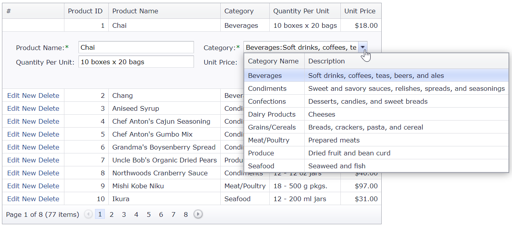

<!-- default badges list -->

[](https://supportcenter.devexpress.com/ticket/details/T328413)
[](https://docs.devexpress.com/GeneralInformation/403183)
<!-- default badges end -->
# Grid View for ASP.NET MVC - How to use a grid lookup control in single selection mode to edit grid data
<!-- run online -->
**[[Run Online]](https://codecentral.devexpress.com/128550902/)**
<!-- run online end -->

This example demonstrates how to add a grid lookup control in single selection mode to the grid's edit form template.



## Overview

The main idea is to use a column's [GridViewColumn.SetEditItemTemplateContent](https://docs.devexpress.com/AspNetMvc/DevExpress.Web.Mvc.MVCxGridViewColumn.SetEditItemTemplateContent.overloads) method to add a grid lookup editor to the edit item template. In this example, the [GridLookupProperties.SelectionMode](https://docs.devexpress.com/AspNet/DevExpress.Web.GridLookupProperties.SelectionMode) property is set to `Single`.

```cshtml
column.SetEditItemTemplateContent(container => {         
    Html.RenderAction("GridLookupPartial", new  { CurrentCategory = DataBinder.Eval(container.DataItem, "CategoryID")  });         
});
```

```cshtml
@Html.DevExpress().GridLookup(settings => {
    settings.Name = "CategoryID";
    settings.Width = Unit.Percentage(100);
    settings.GridViewProperties.CallbackRouteValues = new { Controller = "Home", Action = "GridLookupPartial", CurrentCategory = Model.CategoryID  };
    <!-- ... -->
    settings.Properties.SelectionMode = GridLookupSelectionMode.Single;
}).BindList(ViewData["Categories"]).Bind(Model.CategoryID).GetHtml()
```

To validate edit values on the client side, pass a correct model instance to the PartialView.

```cs
// HomeController.cs
public ActionResult GridLookupPartial(int? CurrentCategory) {
    ViewData["Categories"] = context.Categories;
    if (CurrentCategory == null)
        CurrentCategory = -1;
    return PartialView(new Product() { CategoryID = (int)CurrentCategory });
}
```

## Files to Review

* [HomeController.cs](./CS/E2979MVC/Controllers/HomeController.cs) (VB: [HomeController.vb](./VB/E2979MVC/Controllers/HomeController.vb))
* [GridLookupPartial.cshtml](./CS/E2979MVC/Views/Home/GridLookupPartial.cshtml)
* [ProductsGridViewPartial.cshtml](./CS/E2979MVC/Views/Home/ProductsGridViewPartial.cshtml)

## More Examples

* [Grid View for ASP.NET MVC - How to use a grid lookup control in multiple selection mode to edit grid data](https://github.com/DevExpress-Examples/gridview-how-to-use-gridlookup-in-editform-in-multiple-selection-mode-t328613)
* [Grid View for ASP.NET Web Forms - How to use a grid lookup control in multiple selection mode to edit grid data](https://github.com/DevExpress-Examples/asp-net-web-forms-grid-use-grid-lookup-in-multiple-selection-mode-to-edit-data)
* [Grid View for ASP.NET Web Forms - How to use a two-way data-bound grid lookup control to edit grid data](https://github.com/DevExpress-Examples/how-to-use-two-way-data-bound-aspxgridlookup-in-edit-form-of-aspxgridview-to-edit-data-e2979)
